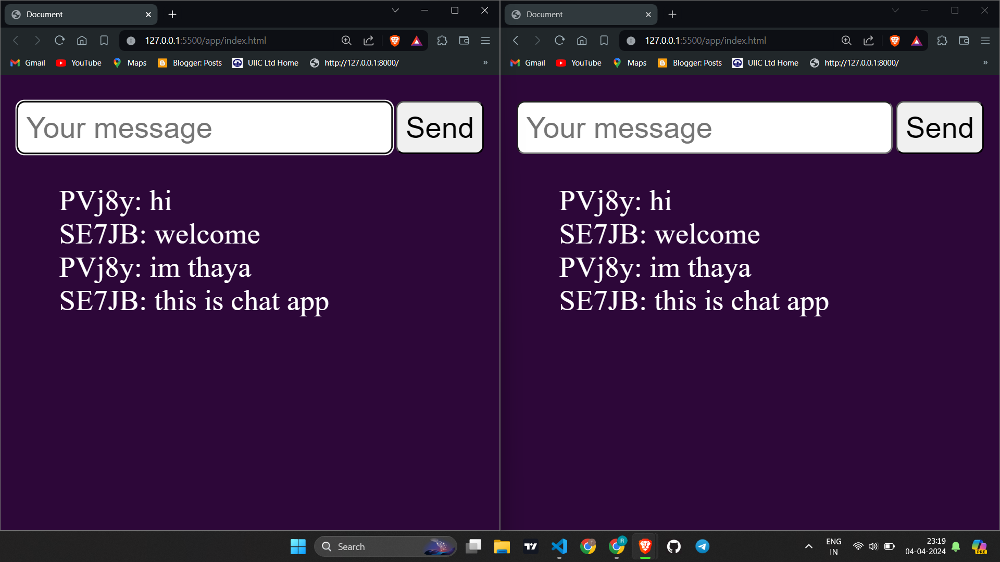

**README.md**

# Socket.io Chat App

This is a basic chat application built using Socket.io. It allows users to join chat rooms and exchange messages in real-time.

## Features

- Real-time messaging: Messages are delivered instantly to all users in the same chat room.
- Multiple chat rooms: Users can create or join different chat rooms for different topics or discussions.
- Simple interface: Clean and user-friendly interface for easy communication.

## Technologies Used

- Node.js
- Express.js
- Socket.io

## Installation

1. Clone the repository:

    ```bash
    git clone https://github.com/your-username/socket-io-chat-app.git
    ```

2. Navigate to the project directory:

    ```bash
    cd socket-io-chat-app
    cd server
    ```

3. Install dependencies:

    ```bash
    npm install
    ```

4. Start the server:

    ```bash
    node server.js
    ```

5. Open your web browser and visit `http://localhost:3000` to view the application.

## Usage

- Enter server
- Choose a chat room or create a new one.
- Start messaging!

## Contributing

Contributions are welcome! If you have any ideas, suggestions, or improvements, feel free to open an issue or create a pull request.

## License

This project is licensed under the MIT License - see the [LICENSE](LICENSE) file for details.

*~ thaya-rk 👾*


